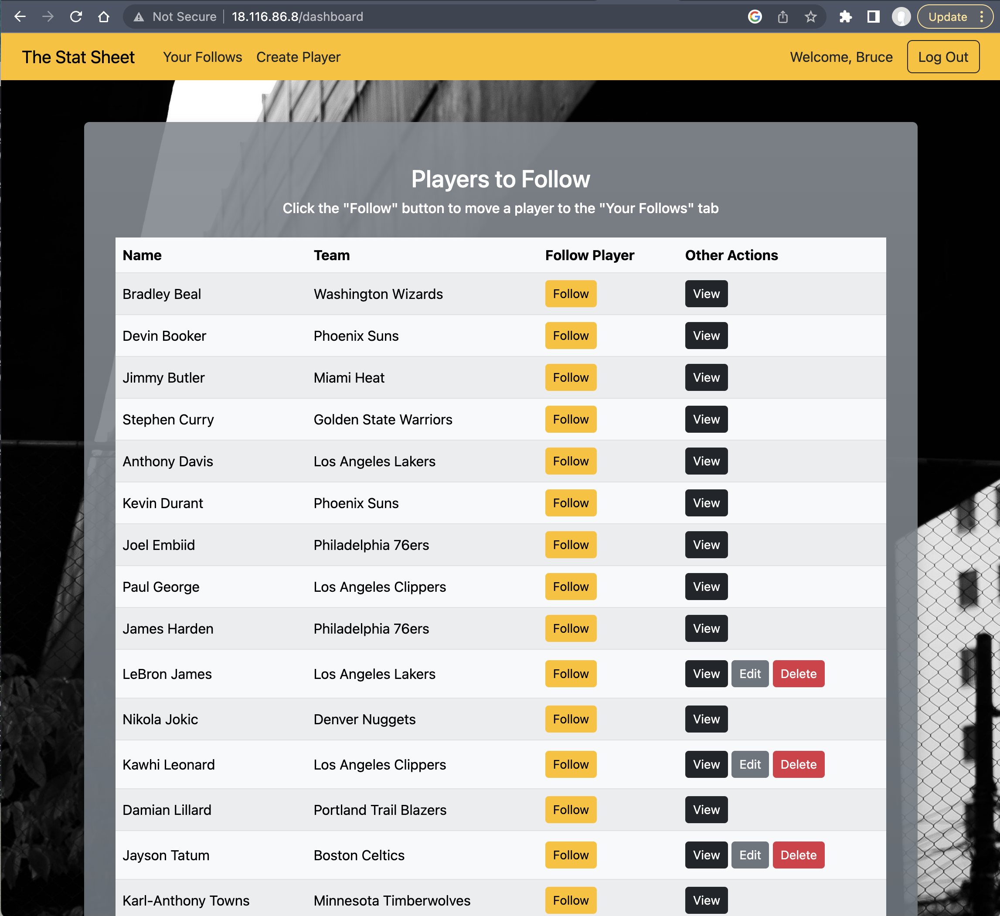

# The Stat Sheet

## Overview

The Stat Sheet offers users the ability to create their own NBA player profiles and view (but not modify) profiles other users have created. Users can also choose to follow their favorite players. An off-canvas element maintains a list of favorited players so that users can view those players' profiles more quickly.

**LIVE LINK AVAILABLE UPON REQUEST**

## Contributors

-   Johnathon Bowers
-   Danny Duong
-   Anthony Kim
-   Alex Tate

## Features

-   Login and registration allows users to create and modify their own NBA player profiles while also being able to view other user-created profiles.

-   User passwords are hashed using bcrypt to make for a more secure user experience.

-   After logging in, users are directed to the main dashboard page, where they can view an alphabetized list of player profiles either they or other users have created.

-   Users can "favorite" various player profiles, which will populate an off-canvas element, viewable by clicking the "Your Follows" Link in the navbar.

## Running the Project

-   Fork this GitHub repository and clone it to your local machine.

-   Make sure you have Python 3 as well as a virtual environment tool such as `pipenv` installed on your local machine.

-   Make sure, as well, that you have installed [MySQL Workbench](https://dev.mysql.com/downloads/workbench/).

-   Open MySQL Workbench, click "File > Open Model..." , and then select the `stat_sheet_schema.mwb` file from the project directory. Once the EER diagram has opened, click "Database > Forward Engineer..." to begin the process of creating your own database schema.

-   In your text editor, navigate to the `mysqlconnection.py` file in the "config" folder and adjust the connection information (e.g., "user" and "password") as necessary so that the project can communicate with your local database.

-   From the root project folder, enter `pipenv install` in your command line to intall the dependencies necessary to run the project.

-   After the dependencies have been installed, run `pipenv shell` to create a virtual environment for the project.

-   To launch your local server and view the project in your browser, enter `python server.py` (Windows) or `python3 server.py` (Mac). Then navigate to `localhost:5000/`.

## Dev Dependencies

## Dev Dependencies

-   [flask](https://flask.palletsprojects.com/en/2.3.x/)
-   [pymysql](https://pypi.org/project/pymysql/)
-   [flask-bcrypt](https://flask-bcrypt.readthedocs.io/en/1.0.1/)
